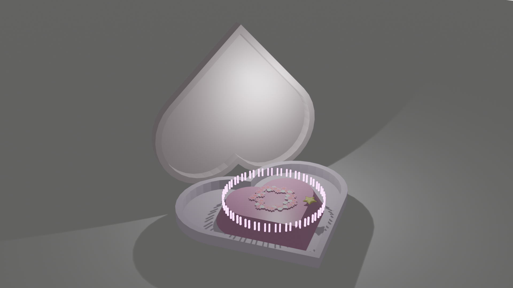
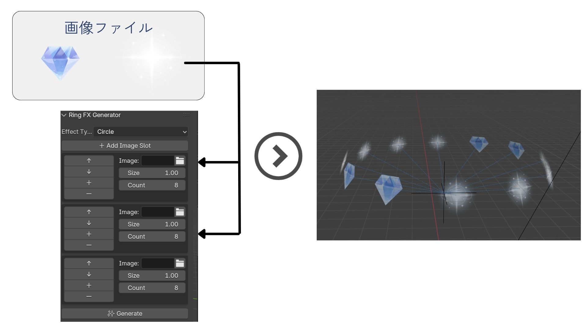

# compact stage - Blenderカスタムツール紹介

## 🔷 概要

「compact stage」は、Blender 4.3.0上で動作する**インタラクティブなステージ演出ツール**です。  
アイドルが活躍するアニメが子供のころから大好きで、演出で見られるような花びら・キラキラ粒子を、直感的なUI操作で制御できるアドオンとして開発しました。  
**Blenderはこの制作のためにblenderのスクリプトを学び始め、約1か月でツール開発までやり遂げたものです。**

このツールは、MV・VTuber演出などにも応用可能です。

---

## 🪄 ツール機能紹介

### Ring FX Generator
円状に画像エフェクトを並べて放出するツールです。  
UIから「画像・サイズ・個数・配置パターン」を設定でき、アイドルステージ風の華やかな演出が可能です。

  

    
指定した画像を円形に並べることで、キラキラや花びらの演出が可能になります。複数枚の画像を組み合わせることで、より華やかな表現ができます。

  

  

### Image Particle Tool
好きなPNG画像（花・ハート・星など）を複数読み込み、個別にサイズや枚数を設定してランダムに飛散させるツール。  
自然な放物線演出も含まれ、演出のアクセントに使えます。

  

    
画像ごとにサイズや出現数を調整可能で、リアルな放物線飛散演出ができます。複数パターンをランダム配置することで自然な粒子演出が行えます。

  

  

### Burst Shape Generator
選択した図形（Sphere, Starなど）を中央から放射状に出現させる演出ツール。  
形状、色、サイズを選べるため、シーンのテンポに合わせて動きを調整できます。

### Hologram Glow FX
ピンクやブルーなどの発光色を選び、ホログラム風のグローエフェクトを生成します。  
舞台装置やSF的な演出、近未来感を出すシーンに最適です。

---

## 🎇 このアドオンを使って制作した作品：「compact stage」

**1.Why I Created This Program**  
アニメに登場するアイドルたちが踊るような、華やかで没入感のあるステージ演出を自分の手で実現したいと思ったからです。限られた空間でも演出の変化が楽しめるように、"コンパクト"かつ演出的に豊かなステージを目指しました。四季の変化や、観客の動きに反応するインタラクティブな演出を意識しています。

**2.What I Focused On While Developing**  
・誰でも直感的に使えるように、UIをシンプルでわかりやすくすること  
・舞台全体の演出テーマがぶれないよう、色や形状、エフェクトのバランスを意識すること

**3.What Was Challenging**  
・Blenderのスクリプトで複数の画像や形状を読み込み、それぞれ個別の設定で飛ばす処理の実装  
・UIパネルからユーザーが指定したパラメータに応じて動的に生成される仕組みの構築  
・1人制作のため、アイデア出し・実装・検証・調整までを自分で回す必要があった点

**4.Key Technical Highlights**  
・形や色、画像を複数追加し、UIからそれぞれサイズ・枚数・放物線範囲を調整できるシステム設計  
・花びらやエフェクトが自然に飛び散るよう、0.5倍の放物線を調整してリアル感を出した点  
・ツールごとに明確な機能分割を行い、ユーザーが演出意図に合わせて使い分けられるよう設計：  
　- Ring FX Generator：円形に画像を配置して演出  
　- Image Particle Tool：複数の画像を指定し、サイズ・個数・動きを細かく制御  
　- Burst Shape Generator：図形を放射状に展開する演出エフェクト  
　- Hologram Glow FX：選択した色でホログラムのような光を追加

**Reference Source**  
・構文チェックや設計整理にはChatGPT-4oを活用

---

## ⚙ 使用技術・環境

| ツール | バージョン・内容 |
|--------|------------------|
| Blender | 4.3.0 |
| Python  | 3.10（bpy API使用） |
| Visual Studio Code | 開発環境 |
| GitHub | ソース管理・公開 |
| ChatGPT-4o | 構造設計・構文確認補助 |

---

## 💡 技術面で工夫した点

### 1. 画像の円形・スパイラル配置と回転アニメーション
**課題**：選んだ画像を使って、キャラクターの周囲に花びらなどのエフェクトを「円形」や「スパイラル状」に生成したい。
回転軸やキーフレームの競合により、思ったように動かず苦労しました。特に F-Curve already exists というエラーには何度も悩まされました。

### 2. スパイラル状の粒子配置
**課題**：粒子をスパイラル（螺旋）状に配置して、見栄えをよくしたい。
回転数や高さの調整をUIから行えるようにしつつ、自然な配置にするためには三次元ベクトルの扱いが難しく、計算に苦労しました。

### 3. サイズや枚数の個別設定が可能なUIの構築
**課題**：画像ごとにサイズや枚数を個別に設定できるようにしたい。
UIで画像を追加するボタンを押しても反映されなかったり、表示がずれたりするなど、バグの対処に苦戦しました。

### 4. 自然落下を使ったアニメーションの実装
**課題**：花びらなどを落下させる際、キーフレームではなく自然な重力落下にしたい。
Rigid Bodyを使うと、画像が不自然な向きで落ちたり、当たり判定が変わったりするなど、意外な不具合が発生しました。アニメーション管理と物理シミュレーションの両立が難しい点も課題でした。

### 5. アドオンの保存と再利用
**課題**：.pyファイルの保存や再読み込みの方法が最初はわかりづらく、他のプロジェクトでも再利用できるようにするまでに時間がかかりました。

これらの経験を通じて、アニメーション制御、UI設計、物理演算、アドオン管理の知識を深めることができました。

---

## 今後の展望

- 音声や表情など「感情」に反応するリアルタイム演出制御
- UnityやUnrealとの連携、他ソフトでも使える汎用性の高いツール化
- Blenderのノードやジオメトリノードと連携した演出の強化

---

## 📂 プログラムコード

このプロジェクトで使用しているアドオンコードは、すべて以下のフォルダに格納されています：

🔗 [compact stage フォルダを見る](./compact%20stage/)

また、各 .py ファイルの使用方法やツールの使い方については、PDF資料内に詳しく記載しています。

---

## 最後に

ここまで丁寧にご覧いただき、誠にありがとうございました。  
短い制作期間ではありましたが、自分の理想とする演出を形にするために全力を注ぎました。  
もし本ツールや取り組みにご興味を持っていただけましたら、ぜひフィードバックをいただけますと幸いです。

---

## 👤 制作者情報

吉田 琳花（Rinka Yoshida）
