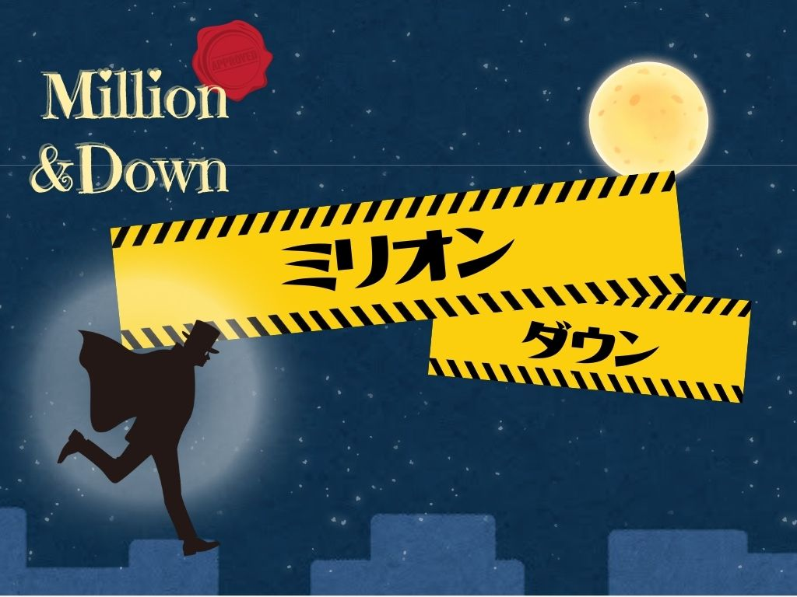

# 吉田琳花 ポートフォリオ

こんにちは！BlenderやUnityを使って、インタラクティブな作品を作っています。

## 🎨 Blender ツール紹介

### キラキラエフェクト生成ツール

図形（星・四角など）を選ぶと、オブジェクトがその形ではじける演出を簡単に作れます。

使い方動画：https://youtu.be/XXXXXX（任意）

---

## 🎮 Unity作品：脳トレゲーム

高齢者向けの認知機能向上ゲーム。UR団地でのリサーチを元に開発しました。

